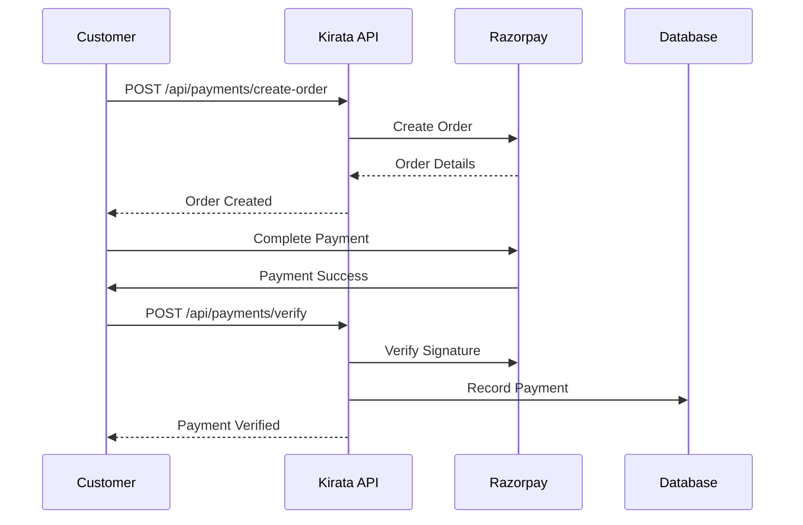
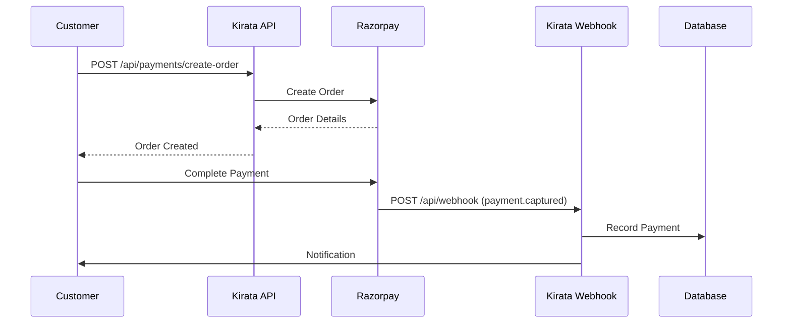

# Payments Service Documentation

## Overview
The Payments Service handles payment processing, order creation, and payment verification for the Kirata system. It integrates with payment gateways to provide secure and reliable payment processing.

## System Design

### Key Components
- **Payment Gateway Integration**: Razorpay integration for UPI, cards, net banking
- **Order Management**: Payment order creation and tracking
- **Verification**: Payment signature verification and validation
- **Transaction Processing**: Secure transaction recording and processing

### Supported Payment Methods
- UPI (Unified Payments Interface)
- Credit/Debit Cards
- Net Banking
- Wallets
- Cash on Delivery (via manual recording)

---

## API Routes & Examples

### 1. Create Payment Order
**Description**: Create a new payment order for processing.

**Endpoint**: `POST /api/payments/create-order`
**Headers**: `Authorization: Bearer <token>` (Role: CUSTOMER)

**Input (JSON)**:
```json
{
  "amount": 250.00,
  "currency": "INR",
  "shopId": "shop-uuid",
  "orderId": "order-uuid",
  "customerId": "customer-uuid",
  "description": "Payment for grocery order #123"
}
```

**Output (JSON)**:
```json
{
  "orderId": "razorpay_order_123456789",
  "amount": 25000,
  "currency": "INR",
  "status": "created",
  "method": "upi",
  "description": "Payment for grocery order #123",
  "notes": {
    "shopId": "shop-uuid",
    "orderId": "order-uuid",
    "customerId": "customer-uuid"
  },
  "createdAt": "2026-01-08T00:48:00.000Z",
  "expiresAt": "2026-01-08T01:00:00.000Z"
}
```

---

### 2. Verify Payment
**Description**: Verify a payment after successful completion.

**Endpoint**: `POST /api/payments/verify`
**Headers**: `Authorization: Bearer <token>` (Role: CUSTOMER)

**Input (JSON)**:
```json
{
  "razorpay_order_id": "razorpay_order_123456789",
  "razorpay_payment_id": "razorpay_payment_123456789",
  "razorpay_signature": "signature_string_123456789",
  "amount": 250.00,
  "shopId": "shop-uuid",
  "orderId": "order-uuid"
}
```

**Output (JSON)**:
```json
{
  "success": true,
  "payment": {
    "paymentId": "payment-uuid",
    "gatewayOrderId": "razorpay_order_123456789",
    "gatewayPaymentId": "razorpay_payment_123456789",
    "gatewaySignature": "signature_string_123456789",
    "amount": 250.00,
    "currency": "INR",
    "status": "COMPLETED",
    "method": "UPI",
    "shopId": "shop-uuid",
    "orderId": "order-uuid",
    "customerId": "customer-uuid",
    "createdAt": "2026-01-08T00:48:00.000Z",
    "updatedAt": "2026-01-08T00:48:30.000Z"
  }
}
```

---

## Payment Flow

### Standard Payment Flow


### Webhook Payment Flow


---

## Payment Statuses

### Order Statuses
- `created`: Order created, awaiting payment
- `attempted`: Payment attempt initiated
- `paid`: Payment successful
- `failed`: Payment failed
- `expired`: Order expired

### Payment Statuses
- `PENDING`: Payment initiated
- `COMPLETED`: Payment successful
- `FAILED`: Payment failed
- `REFUNDED`: Payment refunded
- `DISPUTED`: Payment disputed

---

## Error Responses

### 400 Bad Request
```json
{
  "error": "Bad Request",
  "message": "Amount and Shop ID are required"
}
```

```json
{
  "error": "Bad Request",
  "message": "Missing payment details"
}
```

### 401 Unauthorized
```json
{
  "error": "Unauthorized",
  "message": "Invalid or expired token"
}
```

### 400 Invalid Signature
```json
{
  "error": "Bad Request",
  "message": "Invalid payment signature"
}
```

---

## Integration Examples

### Frontend Integration (React)
```javascript
// Create payment order
const createPaymentOrder = async (amount, shopId, orderId) => {
  const response = await fetch('/api/payments/create-order', {
    method: 'POST',
    headers: {
      'Authorization': `Bearer ${token}`,
      'Content-Type': 'application/json'
    },
    body: JSON.stringify({
      amount,
      shopId,
      orderId,
      currency: 'INR'
    })
  });
  return await response.json();
};

// Verify payment
const verifyPayment = async (paymentDetails) => {
  const response = await fetch('/api/payments/verify', {
    method: 'POST',
    headers: {
      'Authorization': `Bearer ${token}`,
      'Content-Type': 'application/json'
    },
    body: JSON.stringify(paymentDetails)
  });
  return await response.json();
};
```

### Mobile Integration (Android)
```kotlin
// Create payment order
val client = OkHttpClient()
val request = Request.Builder()
    .url("https://api.kirata.com/api/payments/create-order")
    .header("Authorization", "Bearer $token")
    .post(
        FormBody.Builder()
            .add("amount", "250.00")
            .add("shopId", shopId)
            .add("orderId", orderId)
            .build()
    )
    .build()

val response = client.newCall(request).execute()
```

---

## Security Considerations

### Payment Security
- **PCI Compliance**: All payment processing is PCI DSS compliant
- **Tokenization**: Sensitive payment data is tokenized
- **Encryption**: All communication uses TLS 1.2+
- **Signature Verification**: All payments are cryptographically verified

### Fraud Prevention
- **Rate Limiting**: Prevent brute force attacks
- **Amount Validation**: Verify amount matches order
- **Duplicate Detection**: Prevent duplicate payments
- **IP Monitoring**: Monitor suspicious activity

### Data Protection
- **No Storage**: Payment details are not stored
- **Minimal Logging**: Only essential data is logged
- **Access Control**: Strict role-based access

---

## Testing and Validation

### Test Payment Flow
```bash
# 1. Create test order
curl -X POST https://api.kirata.com/api/payments/create-order \
  -H "Authorization: Bearer test_token" \
  -H "Content-Type: application/json" \
  -d '{
    "amount": 100.00,
    "shopId": "test-shop-uuid",
    "orderId": "test-order-uuid"
  }'

# 2. Verify test payment
curl -X POST https://api.kirata.com/api/payments/verify \
  -H "Authorization: Bearer test_token" \
  -H "Content-Type: application/json" \
  -d '{
    "razorpay_order_id": "test_order_123",
    "razorpay_payment_id": "test_payment_123",
    "razorpay_signature": "test_signature_123",
    "amount": 100.00,
    "shopId": "test-shop-uuid",
    "orderId": "test-order-uuid"
  }'
```

### Test Cases
- Successful payment flow
- Failed payment flow
- Invalid signature
- Duplicate payment
- Expired order
- Amount mismatch

---

## Performance Considerations

### Optimization
- **Caching**: Payment configurations cached
- **Parallel Processing**: Concurrent payment handling
- **Database Indexing**: Fast payment lookup
- **Connection Pooling**: Efficient database connections

### Scalability
- **Horizontal Scaling**: Multiple payment servers
- **Load Balancing**: Distributed traffic
- **Queue Processing**: Background job processing
- **Rate Limiting**: Protect against abuse

---

## Monitoring and Analytics

### Payment Metrics
- Success rate
- Failure rate
- Average processing time
- Payment method distribution
- Amount distribution

### Alerting
- Failed payment threshold
- Processing time threshold
- Error rate threshold
- Security alerts

---

## Advanced Features

### Partial Payments
```json
{
  "amount": 150.00,
  "totalAmount": 250.00,
  "isPartial": true,
  "partialPaymentId": "partial-123"
}
```

### Recurring Payments
```json
{
  "amount": 100.00,
  "isRecurring": true,
  "recurringId": "recurring-123",
  "frequency": "MONTHLY",
  "endDate": "2026-12-31"
}
```

### Multi-Currency Support
```json
{
  "amount": 10.00,
  "currency": "USD",
  "exchangeRate": 75.50,
  "baseAmount": 755.00,
  "baseCurrency": "INR"
}
```

---

**Last Updated:** 2026-01-08
**Version:** 1.0.0
**Status:** Production Ready ✅