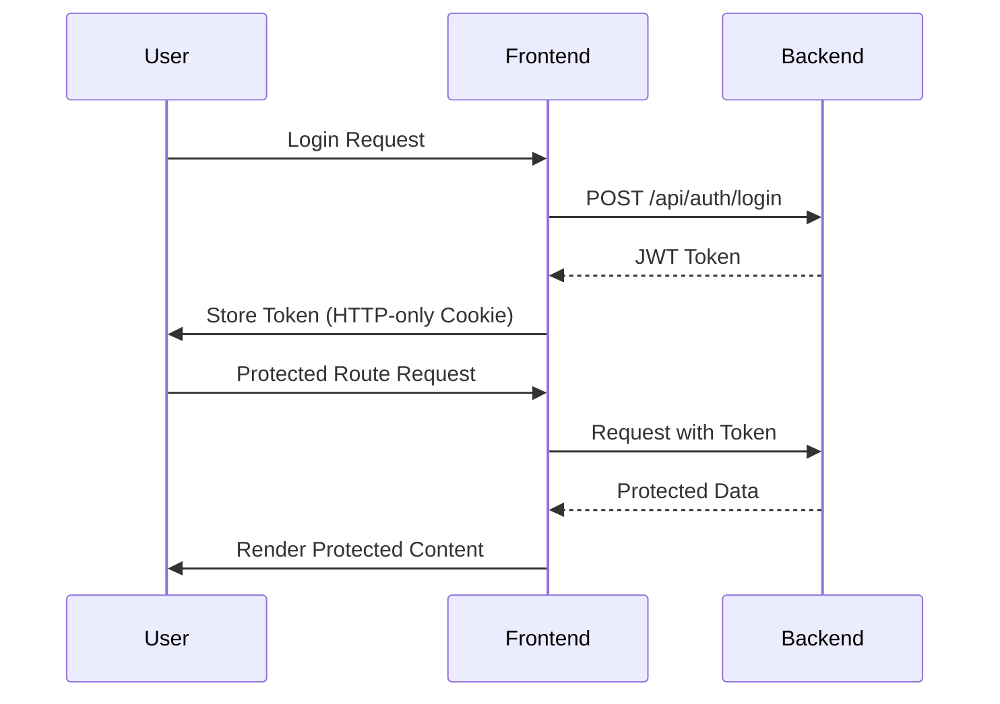

# Kirata Frontend


**Next.js + TypeScript Frontend for Kirata Shop Management System**

---

## 🚀 Quick Start

```bash
# Install dependencies
npm install

# Start development server
npm run dev

# Open in browser
open http://localhost:3000
```

---

## 📚 Project Structure

```
frontend/
├── app/                   # Next.js app router
│   ├── customer/          # Customer pages
│   ├── shop/              # Shopkeeper pages
│   ├── admin/             # Admin pages
│   ├── auth/              # Authentication pages
│   └── (layout)/         # Layout components
├── components/            # Reusable components
│   ├── ui/                # UI primitives
│   ├── customer/          # Customer components
│   ├── shop/              # Shopkeeper components
│   ├── admin/             # Admin components
│   └── landing/           # Landing page components
├── context/               # React context providers
├── hooks/                 # Custom hooks
├── lib/                   # Utilities and API clients
├── services/              # Service layer
├── types/                 # TypeScript types
├── public/                # Static assets
├── styles/                # Global styles
└── README.md              # This file
```

---

## 🎯 Key Features

### User Roles
- ✅ **Customer**: Shop discovery, ordering, payments
- ✅ **Shopkeeper**: Shop management, order processing
- ✅ **Admin**: System administration, verification

### Core Features
- ✅ **Authentication**: JWT + OTP based auth
- ✅ **Shop Discovery**: Location-based search
- ✅ **Order Management**: Full order lifecycle
- ✅ **Payment Processing**: UPI, cards, cash
- ✅ **Ledger System**: Transaction tracking
- ✅ **Analytics Dashboard**: Business insights
- ✅ **Media Management**: Image uploads
- ✅ **Review System**: Ratings and reviews

### Technical Features
- ✅ **Next.js 14**: App router architecture
- ✅ **TypeScript**: Full type safety
- ✅ **Tailwind CSS**: Utility-first styling
- ✅ **React Hook Form**: Form management
- ✅ **Zustand**: State management
- ✅ **Axios**: API client
- ✅ **React Query**: Data fetching
- ✅ **Framer Motion**: Animations

---

## 🔧 Technology Stack

### Core Technologies
- **Framework**: Next.js 14
- **Language**: TypeScript 5.0+
- **Styling**: Tailwind CSS 3.0+
- **State Management**: Zustand
- **Forms**: React Hook Form
- **Routing**: Next.js App Router
- **API Client**: Axios
- **Data Fetching**: React Query
- **Animations**: Framer Motion

### UI Components
- ✅ **Custom Components**: Reusable UI elements
- ✅ **Radix UI**: Accessible primitives
- ✅ **Headless UI**: Unstyled components
- ✅ **Lucide Icons**: Icon library
- ✅ **Tailwind CSS**: Utility-first styling

### Development Tools
- ✅ **ESLint**: Code linting
- ✅ **Prettier**: Code formatting
- ✅ **Jest**: Testing framework
- ✅ **React Testing Library**: Component testing
- ✅ **Storybook**: Component documentation
- ✅ **Husky**: Git hooks
- ✅ **Lint-Staged**: Pre-commit checks

---

## 🛠️ Development Setup

### Prerequisites
- Node.js 18+
- npm 9+
- Next.js CLI

### Installation
```bash
# Install dependencies
npm install

# Set up environment
cp .env.example .env

# Configure API endpoint
NEXT_PUBLIC_API_URL=http://localhost:3000/api
```

### Environment Variables
```env
# API Configuration
NEXT_PUBLIC_API_URL=http://localhost:3000/api
NEXT_PUBLIC_WS_URL=ws://localhost:3000

# Authentication
NEXT_PUBLIC_AUTH_COOKIE_NAME=kirata_token

# Analytics
NEXT_PUBLIC_GA_MEASUREMENT_ID=G-XXXXXXXXXX

# Maps
NEXT_PUBLIC_GOOGLE_MAPS_API_KEY=your_api_key

# Payment Gateway
NEXT_PUBLIC_RAZORPAY_KEY_ID=your_key_id
```

---

## 🚀 Running the Application

### Development Mode
```bash
# Start development server
npm run dev

# Start with specific port
npm run dev -- --port 3001

# Start with debugging
npm run dev:debug
```

### Production Mode
```bash
# Build for production
npm run build

# Start production server
npm start

# Export static site
npm run export
```

### Testing
```bash
# Run tests
npm test

# Run with coverage
npm run test:coverage

# Run linting
npm run lint

# Fix linting issues
npm run lint:fix
```

---

## 📂 Page Structure

### Authentication Pages
- `/login` - User login (OTP/Password)
- `/register` - User registration
- `/forgot-password` - Password recovery
- `/verify-email` - Email verification

### Customer Pages
- `/customer` - Customer dashboard
- `/customer/shops` - Shop discovery
- `/customer/orders` - Order management
- `/customer/ledger` - Transaction history
- `/customer/analytics` - Spending analytics
- `/customer/profile` - Profile management

### Shopkeeper Pages
- `/shop` - Shop dashboard
- `/shop/orders` - Order management
- `/shop/ledger` - Customer ledger
- `/shop/customers` - Customer management
- `/shop/products` - Product management
- `/shop/analytics` - Business analytics
- `/shop/settings` - Shop settings

### Admin Pages
- `/admin` - Admin dashboard
- `/admin/shops` - Shop verification
- `/admin/users` - User management
- `/admin/analytics` - System analytics
- `/admin/reports` - Reporting

---

## 🎨 Design System

### Color Palette
```javascript
const colors = {
  primary: {
    50: '#EFF6FF',
    100: '#DBEAFE',
    200: '#BFDBFE',
    300: '#93C5FD',
    400: '#60A5FA',
    500: '#3B82F6', // Primary
    600: '#2563EB',
    700: '#1D4ED8',
    800: '#1E40AF',
    900: '#1E3A8A',
  },
  secondary: {
    500: '#6366F1', // Indigo
  },
  success: '#10B981',
  warning: '#F59E0B',
  error: '#EF4444',
  info: '#06B6D4',
}
```

### Typography
```javascript
const fonts = {
  sans: ['Inter', 'sans-serif'],
  serif: ['Georgia', 'serif'],
  mono: ['Monaco', 'monospace'],
}

const fontSizes = {
  xs: '0.75rem',
  sm: '0.875rem',
  base: '1rem',
  lg: '1.125rem',
  xl: '1.25rem',
  '2xl': '1.5rem',
  '3xl': '1.875rem',
  '4xl': '2.25rem',
  '5xl': '3rem',
  '6xl': '3.75rem',
  '7xl': '4.5rem',
  '8xl': '6rem',
  '9xl': '8rem',
}
```

### Spacing
```javascript
const spacing = {
  0: '0rem',
  1: '0.25rem',
  2: '0.5rem',
  3: '0.75rem',
  4: '1rem',
  5: '1.25rem',
  6: '1.5rem',
  8: '2rem',
  10: '2.5rem',
  12: '3rem',
  16: '4rem',
  20: '5rem',
  24: '6rem',
  32: '8rem',
  40: '10rem',
  48: '12rem',
  56: '14rem',
  64: '16rem',
}
```

---

## 🔒 Authentication Flow

### User Authentication


### Session Management
- ✅ **JWT Tokens**: Secure stateless authentication
- ✅ **HTTP-only Cookies**: Protection against XSS
- ✅ **Refresh Tokens**: Long-lived sessions
- ✅ **Session Timeout**: Automatic logout
- ✅ **Multi-device Support**: Session management

---

## 📊 State Management

### Zustand Stores
```javascript
// Auth Store
const useAuthStore = create((set) => ({
  user: null,
  token: null,
  isAuthenticated: false,
  login: (user, token) => set({ user, token, isAuthenticated: true }),
  logout: () => set({ user: null, token: null, isAuthenticated: false }),
}))

// Shop Store
const useShopStore = create((set) => ({
  shop: null,
  isLoading: false,
  error: null,
  fetchShop: async (shopId) => {
    set({ isLoading: true, error: null })
    try {
      const shop = await api.getShop(shopId)
      set({ shop, isLoading: false })
    } catch (error) {
      set({ error, isLoading: false })
    }
  },
}))
```

### React Query Usage
```javascript
// Data Fetching
const { data, isLoading, error } = useQuery(
  ['shop', shopId],
  () => api.getShop(shopId),
  {
    staleTime: 5 * 60 * 1000, // 5 minutes
    cacheTime: 10 * 60 * 1000, // 10 minutes
  }
)

// Mutations
const mutation = useMutation(
  (orderData) => api.createOrder(orderData),
  {
    onSuccess: (data) => {
      queryClient.invalidateQueries('orders')
      toast.success('Order created successfully')
    },
    onError: (error) => {
      toast.error('Failed to create order')
    },
  }
)
```

---

## 🎨 Component Library

### UI Primitives
- ✅ **Button**: Customizable buttons
- ✅ **Input**: Form inputs with validation
- ✅ **Card**: Content cards
- ✅ **Modal**: Dialog modals
- ✅ **Toast**: Notification toasts
- ✅ **Tooltip**: Hover tooltips
- ✅ **Dropdown**: Dropdown menus
- ✅ **Tabs**: Tab navigation

### Domain Components
- ✅ **ShopCard**: Shop display component
- ✅ **OrderCard**: Order summary component
- ✅ **ProductCard**: Product display component
- ✅ **ReviewCard**: Review display component
- ✅ **LedgerTable**: Transaction table
- ✅ **AnalyticsChart**: Data visualization
- ✅ **SearchBar**: Search functionality

---

## 🤝 API Integration

### API Client
```javascript
// lib/api.ts
const api = axios.create({
  baseURL: process.env.NEXT_PUBLIC_API_URL,
  timeout: 10000,
  headers: {
    'Content-Type': 'application/json',
  },
})

// Request interceptor
api.interceptors.request.use((config) => {
  const token = getAuthToken()
  if (token) {
    config.headers.Authorization = `Bearer ${token}`
  }
  return config
})

// Response interceptor
api.interceptors.response.use(
  (response) => response.data,
  (error) => {
    if (error.response?.status === 401) {
      // Handle unauthorized
    }
    return Promise.reject(error)
  }
)
```

### Service Layer
```javascript
// services/shop-service.ts
export const ShopService = {
  async getShop(shopId: string) {
    return api.get(`/shops/${shopId}`)
  },

  async createShop(shopData: ShopInput) {
    return api.post('/shops', shopData)
  },

  async updateShop(shopId: string, shopData: Partial<ShopInput>) {
    return api.patch(`/shops/${shopId}`, shopData)
  },

  async searchShops(params: SearchParams) {
    return api.get('/shops/search', { params })
  },
}
```

---

## 📱 Responsive Design

### Breakpoints
```javascript
const breakpoints = {
  sm: '640px',
  md: '768px',
  lg: '1024px',
  xl: '1280px',
  '2xl': '1536px',
}
```

### Mobile-First Approach
```javascript
// Tailwind responsive classes
<div className="text-sm md:text-base lg:text-lg">
  Responsive text
</div>

<div className="grid grid-cols-1 md:grid-cols-2 lg:grid-cols-3 gap-4">
  Responsive grid
</div>
```

### Touch Optimization
- ✅ **Larger Tap Targets**: Minimum 48x48px
- ✅ **Touch Feedback**: Visual feedback on touch
- ✅ **Swipe Gestures**: Intuitive navigation
- ✅ **Mobile Menus**: Optimized for touch

---

## 📈 Performance Optimization

### Next.js Features
- ✅ **SSR/SSG**: Server-side rendering and static generation
- ✅ **ISR**: Incremental static regeneration
- ✅ **Image Optimization**: Automatic image optimization
- ✅ **Code Splitting**: Automatic code splitting
- ✅ **Prefetching**: Route prefetching

### Frontend Optimization
- ✅ **Lazy Loading**: Component-level lazy loading
- ✅ **Memoization**: React.memo for components
- ✅ **Virtualization**: List virtualization
- ✅ **Bundle Analysis**: Webpack bundle analyzer
- ✅ **Tree Shaking**: Dead code elimination

---

## 🚢 Deployment

### Vercel Deployment
```bash
# Install Vercel CLI
npm install -g vercel

# Deploy to Vercel
vercel

# Production deployment
vercel --prod
```

### Docker Deployment
```bash
# Build Docker image
docker build -t kirata-frontend .

# Run with Docker
docker run -p 3000:3000 kirata-frontend
```

### Static Export
```bash
# Build static site
npm run build
npm run export

# Serve static site
npx serve out
```

---

## 📝 Best Practices

### Code Quality
- ✅ **TypeScript**: Full type safety
- ✅ **ESLint**: Code linting
- ✅ **Prettier**: Code formatting
- ✅ **Tests**: Comprehensive test coverage

### Performance
- ✅ **Lazy Loading**: Load components on demand
- ✅ **Memoization**: Optimize component rendering
- ✅ **Virtualization**: Handle large lists efficiently
- ✅ **Image Optimization**: Optimize all images

### Accessibility
- ✅ **Semantic HTML**: Proper HTML structure
- ✅ **ARIA Attributes**: Accessibility attributes
- ✅ **Keyboard Navigation**: Full keyboard support
- ✅ **Color Contrast**: WCAG compliant contrast

### Security
- ✅ **Input Validation**: Validate all inputs
- ✅ **Sanitization**: Sanitize user content
- ✅ **CSRF Protection**: Anti-CSRF tokens
- ✅ **CSP**: Content Security Policy

---

## 🎉 Quick Links

- **[Backend Documentation](../backend/README.md)** - Backend API reference
- **[API Docs](../backend/docs/api/README.md)** - Complete API documentation
- **[Setup Guide](../backend/docs/setup/README.md)** - Installation instructions
- **[Deployment Guide](../backend/docs/deployment/README.md)** - Production deployment

---

**Version**: 1.0.0
**Last Updated**: 2026-01-08
**Status**: 🚀 Production Ready
**Maintainer**: Yogesh Kumar Saini

---

> "Beautiful interfaces for local businesses" - Kirata Team